<div align="center">
    
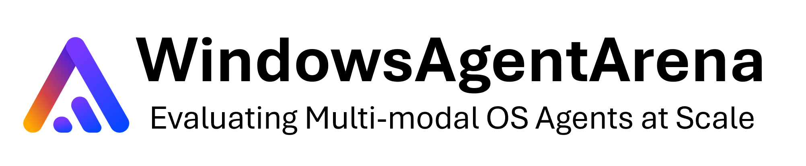
[](https://microsoft.github.io/WindowsAgentArena)
[](https://github.com/microsoft/WindowsAgentArena/raw/229997e5ea7991c9976b7f86c07dc5102722534a/static/files/windows_agent_arena.pdf)
[](https://opensource.org/licenses/MIT)
[](https://github.com/microsoft/WindowsAgentArena)

</div>

**Windows Agent Arena (WAA) 🪟** is a scalable OS platform for testing and benchmarking multi-modal AI agents. WAA empowers researchers and developers with a reproduceable and realistic Windows OS environment where they can test AI models in a diverse range of tasks. 

We offer deployment of agents **at scale** using the Azure cloud infrastructure. You can run multiple agents in parallel and get results for hundreds of tasks in a matter of minutes, not days.

<div align="center">
    <video src="https://github.com/user-attachments/assets/e0a8d88d-d28a-493d-b74f-2455f36c21f1" width="400" alt="waa_intro">
</div>

## 📢 Updates
- 2024-09-11: We released our [paper](https://github.com/microsoft/WindowsAgentArena/raw/229997e5ea7991c9976b7f86c07dc5102722534a/static/files/windows_agent_arena.pdf), [code](https://github.com/microsoft/WindowsAgentArena), [project page](https://microsoft.github.io/WindowsAgentArena), and [blog post](https://www.microsoft.com/applied-sciences/projects/windows-agent-arena). Check it out!

## 📚 Citation
Our technical report paper can be found [here](https://github.com/microsoft/WindowsAgentArena/raw/229997e5ea7991c9976b7f86c07dc5102722534a/static/files/windows_agent_arena.pdf).
If you find this environment useful, please consider citing our work:
```
@article{bonatti2024windows,
author = { Bonatti, Rogerio and Zhao, Dan and Bonacci, Francesco and Dupont, Dillon, and Abdali, Sara and Li, Yinheng and Wagle, Justin and Koishida, Kazuhito and Bucker, Arthur and Jang, Lawrence and Hui, Zack},
title = {Windows Agent Arena: Evaluating Multi-Modal OS Agents at Scale},
institution = {Microsoft},
year = {2024},
month = {September}, 
}
```

## ☝️ Pre-requisites:

<div align="center">
    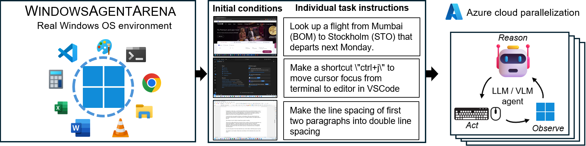
</div>

- Docker daemon installed and running. On Windows, we recommend using [Docker with WSL 2](https://docs.docker.com/desktop/wsl/).
- An [OpenAI](https://platform.openai.com/docs/introduction) or [Azure OpenAI](https://azure.microsoft.com/en-us/products/ai-services/openai-service) API Key.
- Python 3.9 - we recommend using [Conda](https://docs.conda.io/projects/conda/en/latest/user-guide/getting-started.html) and creating an adhoc python environment for running the scripts. For creating a new environment run `conda create -n winarena python=3.9`.

Clone the repository and install dependencies:
```bash
git clone https://github.com/microsoft/WindowsAgentArena.git
cd WindowsAgentArena
```

```bash
# Install the required dependencies in your python environment
# conda activate winarena
pip install -r requirements.txt
```

## 💻 Local deployment (WSL or Linux)


### 1. Configuration file
Create a new `config.json` at the root of the project with the necessary keys (from OpenAI or Azure endpoints):

```json
{
    "OPENAI_API_KEY": "<OPENAI_API_KEY>", // if you are using OpenAI endpoint
    "AZURE_API_KEY": "<AZURE_API_KEY>",  // if you are using Azure endpoint
    "AZURE_ENDPOINT": "https://yourendpoint.openai.azure.com/", // if you are using Azure endpoint
}
```

### 2. Prepare the Windows Arena Docker image

To use the default docker image from Docker Hub:

```bash
docker pull windowsarena/winarena:latest
```

#### (Optional) 2.1 Build the Windows Arena Docker image locally:

To build your own image from scratch (optional): 
```bash
cd scripts
./build-container-image.sh
```

For a list of parameters that can be changed during building of the docker images:
```bash
./build-container-image.sh --help
```

### 3. Prepare the Windows 11 image

<div align="center">
    <video src="https://github.com/user-attachments/assets/6d55b9b5-3242-49af-be20-64f2086108b9" height="500" alt="local_prepare_golden_image">
</div>

#### 3.1 Download Windows 11 Evaluation .iso file:
1. Visit [Microsoft Evaluation Center](https://info.microsoft.com/ww-landing-windows-11-enterprise.html), accept the Terms of Service, and download a **Windows 11 Enterprise Evaluation (90-day trial, English, United States)** ISO file [~6GB]
2. After downloading, rename the file to `setup.iso` and copy it to the directory `WindowsAgentArena/src/win-arena-container/vm/image`

#### 3.2 Automatic Setup of the Windows 11 golden image:
Before running the arena, you need to prepare a new WAA snapshot (also referred as WAA golden image). This 30GB snapshot represents a fully functional Windows 11 VM with all the programs needed to run the benchmark. This VM additionally hosts a Python server which receives and executes agent commands. To learn more about the components at play, see our [local](/img/architecture-local.png) and [cloud](/img/architecture-azure.png) components diagrams.

To prepare the gold snapshot, run **once**:
```bash
cd ./scripts
./run-local.sh --prepare-image true
```

During development, if you want to include any changes made in the `src/win-arena-container` directory in the WAA golden image, please ensure to specify the flag `--skip-build false` (default to true). This will ensure that a new container image is built instead than using the prebuilt `windowsarena/winarena:latest` image.

You can check the VM install screen by accessing `http://localhost:8006` in your browser (unless you have provided an alternate `--browser-port` parameter). The preparation process is fully automated and will take around 20 minutes. 

**Please do not interfere with the VM while it is being prepared. It will automatically shut down when the provisioning process is complete.**

<div align="center">
    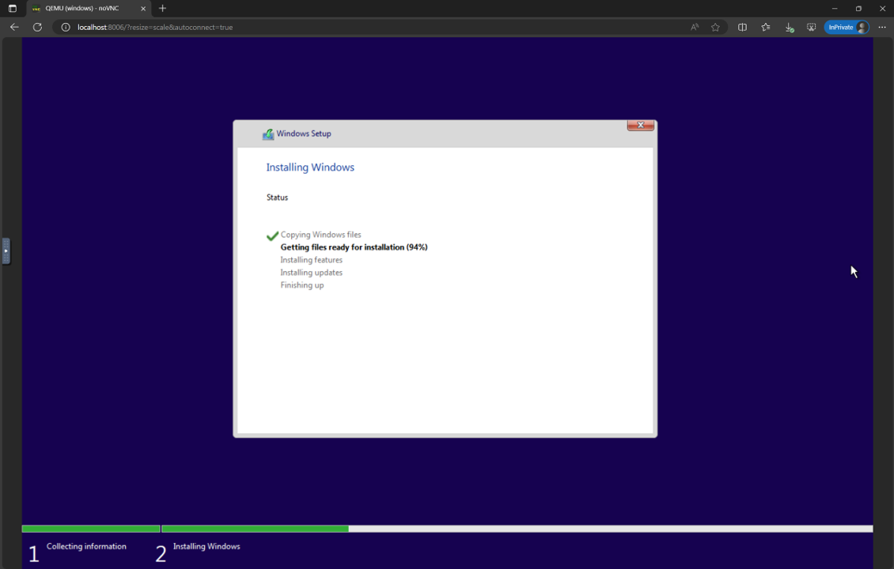
</div>

<div align="center">
    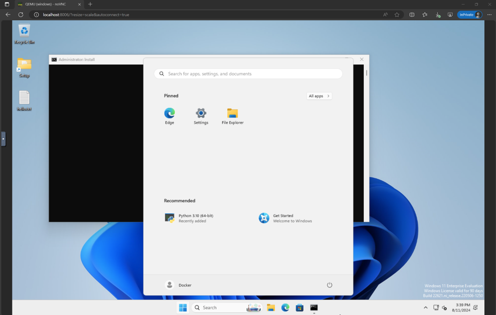
</div>

At the end, you should expect the Docker container named `winarena` to gracefully terminate as shown from the below logs.

<div align="center">
    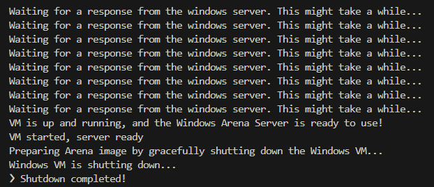
</div>

<br/>

You will find the 30GB WAA golden image in `WindowsAgentArena/src/win-arena-container/vm/storage`, consisting of the following files:

<div align="center">
    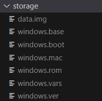
</div>

<br/>

NOTES:
- If you have previously run an installation process and want to do it again from scratch, make sure to delete the content of `storage`.
- We recommend copying this `storage` folder to a safe location outside of the repository in case you or the agent accidentally corrupt the VM at some point and you want to avoid a fresh setup.
- Depending on your docker settings, you might have to run the above command with `sudo`.
- Running on WSL2? If you encounter the error `/bin/bash: bad interpreter: No such file or directory`, we recommend converting the bash scripts from DOS/Windows format to Unix format:
```bash
cd ./scripts
find . -maxdepth 1 -type f -exec dos2unix {} +
```

### 4. Deploying the agent in the arena

#### 4.1 Running the base benchmark

The entire setup runs inside a docker container. The entry point for the agent is the `src/win-arena-container/run.py` script (copied to `/client/run.py` in the container). The Windows OS runs as a VM process inside the container, and they communicate via GET/POST. To run the entire setup at once, run:

```bash
cd scripts
./run-local.sh --start-client true
```

On your host, open your browser and go to http://localhost:8006 to see the Windows VM with the agent running.

For a list of parameters that can be changed:
```bash
./run-local.sh --help
```

At the end of the run you can display the results using the command:
```bash
cd src/win-arena-container/client
python show_results.py --result_dir <path_to_results_folder>
```

The table below provides a comparison of various combinations of hyperparameters used by the Navi agent in our study, which can be overridden by specifying `--som-origin <som_origin> --a11y-backend <a11y_backend>` when running the `run-local.sh` script:

| Hyperparameter     | Possible Values                    | Description                                                                                      | Recommended Complementary Value                   |
|---------------|------------------------------------|--------------------------------------------------------------------------------------------------|-----------------------------------------------------|
| `som_origin`  | `oss`, `a11y`, `mixed-oss`          | Determines how the Set-of-Mark (SoM) is achieved.                                                | `win32` for `oss`; `uia` for `a11y`, `mixed-oss`   |
|               | `mixed-oss`  | If set to any "mixed" option, the agent partially relies on the accessibility tree for SoM entities. | `uia` (more reliable but slower)                   |
|               | `oss`                               | Uses webparse, groundingdino, and OCR (TesseractOCR) pipelines.                                   | `win32` (faster performance)                       |
|               | `a11y`                              | Relies on accessibility tree extraction for SoM.                                                 | `uia` (more reliable but slower)                   |
| `a11y_backend`| `win32`, `uia`                      | Dictates how the accessibility tree should be extracted.                                          | `win32` for `oss`; `uia` for `a11y` and mixed types|
|               | `win32`                             | Faster but less reliable accessibility tree extraction.                                           | Use with `oss` or non-"mixed" types.               |
|               | `uia`                               | Slower but more reliable accessibility tree extraction.                                           | Use with `a11y`, `mixed-oss` |

#### 4.2 Local development tips

At first sight it might seem challenging to develop/debug code running inside the docker container. However, we provide a few tips to make this process easier. Check the [Development-Tips Doc](./docs/Development-Tips.md) for more details such as:
- How to attach a VSCode window (with debugger) to the running container
- How to change the agent and Windows server code from your local machine and see the changes reflected in real time in the container

## 🌐 Azure Deployment -> Parallelizing the benchmark 

We offer a seamless way to run the Windows Agent Arena on Azure ML Compute VMs. This option will significantly reduce the time needed to test your agent in all benchmark tasks from hours/days to minutes.

### 1. Set up the Azure resource group:

- If you don't already have an Azure subscription, you can start a [free trial](https://azure.microsoft.com/en-us/free/). Take note of the subscription id, we will use it as `AZURE_SUBSCRIPTION_ID` in Section 3.
- In the [Azure portal](https://portal.azure.com/), create a new resource group (e.g. `agents`) in the region of your choice. Take note of the resource group name, we will use it as `AZURE_ML_RESOURCE_GROUP` in Section 3.
- Within this resource group, create an Azure Machine Learning resource (e.g. name it `agents_ml`). Take note of the ML workspace name, we will use it as `AZURE_ML_WORKSPACE_NAME` in Section 3. During the creation wizard, make sure to check the boxes for automatically creating new:
    - Storage Account. **Note:** Take note of the Storage Account name, we will use it to upload the golden image in Section 2.
    - Key vault.
    - Application Insights.
    - [optional] Container Registry. You can use the Azure Container Registry to privately store your custom docker images without the need to push them to the public Docker Hub.

<div align="center">
    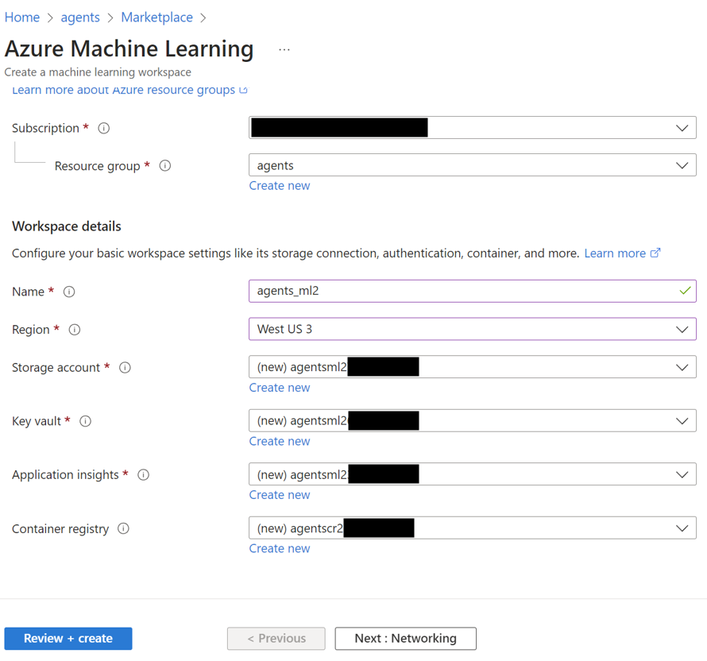
</div>

- Once creation is complete, navigate to the [Azure Machine Learning portal](https://ml.azure.com/home) and click on your workspace (`agents`)

<div align="center">
    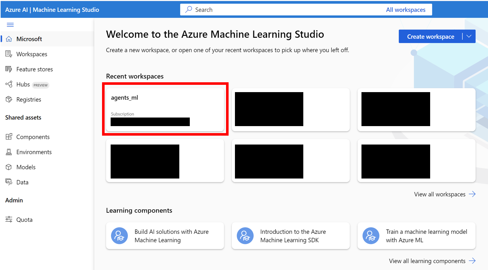
</div>

- In the workspace, navigate to the `Notebooks` tab. In your user-assigned folder (as shown in the figure below), create a new bash (.sh) file named `compute-instance-startup.sh`. Copy the content of `scripts/azure_files/compute-instance-startup.sh` into this file and save it. This script will be used every time a new VM is launched in Azure to apply some base configurations. Take note of the path where you save the file (in the form of `Users/<YOUR_USER>/compute-instance-startup.sh`), we will use it to run the script in Section 3.

<div align="center">
    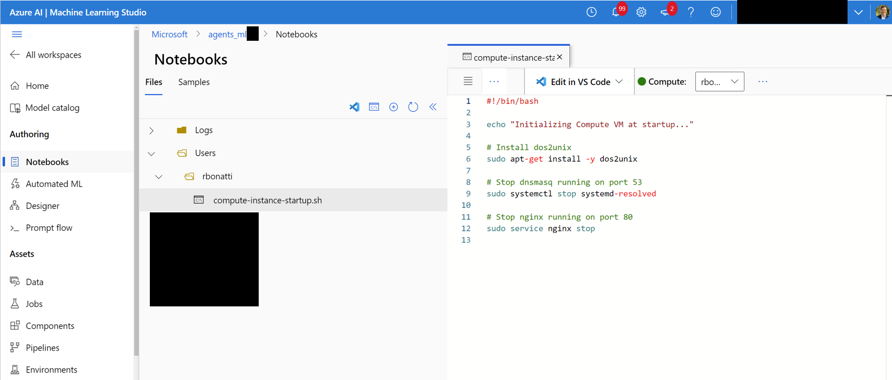
</div>

- [Optional] You might want to ask for more compute quota for your region depending on your needs. You can do so by navigating to the [Azure Quota page](https://ml.azure.com/quota/). As a reference, we currently use the `Standard_D8_v3` VM size for our benchmarking, which falls under the `Standard Dv3 Family Cluster Dedicated vCPUs` category. Each VM uses 8 cores. Make sure the machine type you use supports [nested virtualization](https://learn.microsoft.com/en-us/answers/questions/813416/how-do-i-know-what-size-azure-vm-supports-nested-v).

<div align="center">
    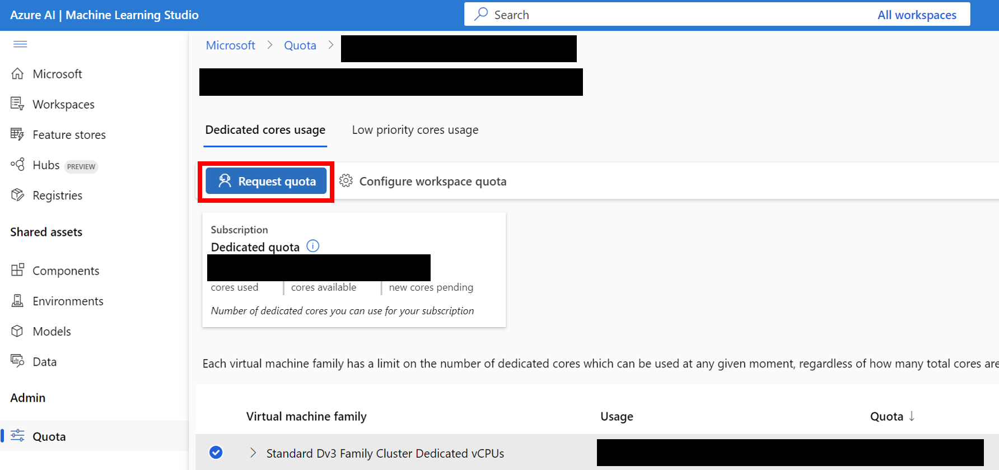
</div>


### 2. Uploading Windows 11 and Docker images to Azure

- Upload the Windows 11 storage folder to the Blob container associated with your default datastore. By default, the Azure ML Workspace's underlying data is backed by a Storage Account through one or more ML datastores. The default datastore, named `workspaceblobstore`, is created during the workspace setup and linked to a Blob container under the Azure Storage Account. You can review the association between the datastores and containers by visiting [Azure ML Datastore](https://ml.azure.com/data/datastore). Once found, you can then upload the storage folder in different ways:
    - Download the [Azure Storage Explorer](https://azure.microsoft.com/en-us/features/storage-explorer/) program, log in, and select the blob container. Upload the `WindowsAgentArena/src/win-arena-container/vm/storage` folder from your local machine after running the local setup steps.<div align="center">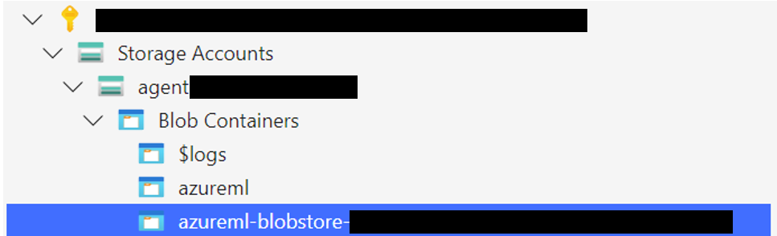</div>
    - Alternatively, you can use the Azure CLI to upload the folder. To install the CLI, follow the steps provided [here](https://learn.microsoft.com/en-us/cli/azure/install-azure-cli). Once installed, you can use the following command:
        ```bash
        az login --use-device-code # Only needed if prompted
        az storage blob upload-batch --account-name <STORAGE_ACCOUNT_NAME> --destination <CONTAINER_NAME> --source <LOCAL_FOLDER>
        # For a list of parameters check: https://docs.microsoft.com/en-us/cli/azure/storage/blob?view=azure-cli-latest
        ```
    - Alternatively, use the [Azure portal](https://portal.azure.com/) interface to upload the folder. Navigate to the storage account, click on `Storage browser->Blob containers`, select your container, and upload the folder. This option is not recomended for large files as connections might get unstable.
    
- [Optional] If you are not using the default `windowsarena/winarena:latest` image, you can upload your custom image to the Azure Container Registry. You can do so by following the [Azure Container Registry documentation](https://docs.microsoft.com/en-us/azure/container-registry/container-registry-get-started-portal)
    ```bash
    az login --use-device-code
    # potentially needed if commands below don't work: az acr login --name <ACR_NAME>
    docker login # you will be prompted to enter your ACR credentials (username + password which can be found in the Azure portal)
    docker tag <IMAGE_NAME> <ACR_NAME>.azurecr.io/<IMAGE_NAME>:<TAG>
    docker push <ACR_NAME>.azurecr.io/<IMAGE_NAME>:<TAG>
    ```

### 3. Environment configurations and deployment

- Add the additional keys to the `config.json` file at the root of the project:
```json
{
    ... // Your previous configs

    "AZURE_SUBSCRIPTION_ID": "<YOUR_AZURE_SUBSCRIPTION_ID>", 
    "AZURE_ML_RESOURCE_GROUP": "<YOUR_AZURE_ML_RESOURCE_GROUP>",
    "AZURE_ML_WORKSPACE_NAME": "<YOUR_AZURE_ML_WORKSPACE_NAME>"
}
```

- Create a new file named `experiments.json` to specify any parameters needed for each experiment run, including the agent to deploy and the underlying LLM model to use. You can find a reference `experiments.json` consisting of multiple experiments to run at [`scripts/experiments.json`](scripts\experiments.json):
```json
{
  "experiment_1": {
    "ci_startup_script_path": "Users/<YOUR_USER>/compute-instance-startup.sh", // As seen in Section 1
    "agent": "navi",
    "datastore_input_path": "storage",
    "docker_img_name": "windowsarena/winarena:latest",
    "exp_name": "experiment_1",
    "num_workers": 4,
    "use_managed_identity": false,
    "json_name": "evaluation_examples_windows/test_all.json",
    "model_name": "gpt-4-1106-vision-preview",
    "som_origin": "oss", // or a11y, or mixed-oss
    "a11y_backend": "win32" // or uia
  }
  // ...
}
```
- (Optional) You can also generate the `experiments.json` by using both the `--experiments_json` and `--update_json` parameters of `run_azure.py`, the above JSON is equivalent to the following command:
```bash
cd scripts
python run_azure.py --experiments_json "experiments.json" --update_json --exp_name "experiment_1" --ci_startup_script_path "Users/<YOUR_USER>/compute-instance-startup.sh" --agent "navi" --json_name "evaluation_examples_windows/test_all.json" --num_workers 4 --som_origin oss --a11y_backend win32
```

- Deploy the agent on Azure ML Compute by running:
```bash
az login --use-device-code # https://learn.microsoft.com/en-us/cli/azure/install-azure-cli
# If multiple tenants or subscriptions, make sure to select the right ones with:
# az login --use-device-code --tenant "<YOUR_AZURE_AD_TENANT_ID>"
# az account set --subscription "<YOUR_AZURE_AD_TENANT_ID>"

# Make sure you have installed the python requirements in your conda environment
# conda activate winarena
# pip install -r requirements.txt

# From your activated conda environment:
cd scripts
python run_azure.py --experiments_json "experiments.json"
```

For any unfinished experiments in `experiments.json`, the script will: 
1. Create `<num_workers` Azure Compute Instance VMs.
2. Run one ML Training Job named `<exp_name>` per VM.
3. Dispose the VMs once the jobs are completed.

The logs from the run will be saved in a `agent_outputs` folder in the same blob container where you uploaded the Windows 11 image. You can download the `agent_outputs` folder to your local machine and run the `show_azure.py` script to see the results from every experiment as a markdown table.

```bash
cd scripts
python show_azure.py --json_config "experiments.json" --result_dir <path_to_downloaded_agent_outputs_folder>
```

## 🤖 BYOA: Bring Your Own Agent
Want to test your own agents in Windows Agent Arena? You can use our default agent as a template and create your own folder under `src/win-arena-container/client/mm_agents`. You just need to make sure that your `agent.py` file features `predict()` and `reset()` functions. For more information on agent development check out the [BYOA Doc](./docs/Develop-Agent.md).

## 👩‍💻 Open-source contributions

We welcome contributions to the Windows Agent Arena project. In particular, we welcome:
- New open-sourced agents to be added to the benchmark
- New tasks to be added to our existing categories, or new categories altogether

If you are interested in contributing, please check out our [Task Development Guidelines](./docs/Develop-Tasks.md).

## ❓ FAQ
### What are approximate running times and costs for the benchmark?
| Component | Cost | Time |
|----------|----------|----------|
| Azure Standard_D8_v3 VM    | ~$8 ($0.38/h * 40 * 0.5h)   |    |
| GPT-4V    | $100   |  ~35min with 40 VMs  |
| GPT-4o    | $100   | ~35min with 40 VMs   |
| GPT-4o-mini    | $15   | ~30min with 40 VMs   |

## 👏 Acknowledgements

We thank the [OS World](https://github.com/xlang-ai/OSWorld) and [Dockur](https://github.com/dockur/windows) teams for their open-source frameworks which inspired this project.

## 🤝 Contributing

This project welcomes contributions and suggestions.  Most contributions require you to agree to a
Contributor License Agreement (CLA) declaring that you have the right to, and actually do, grant us
the rights to use your contribution. For details, visit https://cla.opensource.microsoft.com.

When you submit a pull request, a CLA bot will automatically determine whether you need to provide
a CLA and decorate the PR appropriately (e.g., status check, comment). Simply follow the instructions
provided by the bot. You will only need to do this once across all repos using our CLA.

This project has adopted the [Microsoft Open Source Code of Conduct](https://opensource.microsoft.com/codeofconduct/).
For more information see the [Code of Conduct FAQ](https://opensource.microsoft.com/codeofconduct/faq/) or
contact [opencode@microsoft.com](mailto:opencode@microsoft.com) with any additional questions or comments.

## 🛡️ Trademarks

This project may contain trademarks or logos for projects, products, or services. Authorized use of Microsoft trademarks or logos is subject to and must follow [Microsoft's Trademark & Brand Guidelines](https://www.microsoft.com/en-us/legal/intellectualproperty/trademarks/usage/general).
Use of Microsoft trademarks or logos in modified versions of this project must not cause confusion or imply Microsoft sponsorship.
Any use of third-party trademarks or logos are subject to those third-party's policies.
