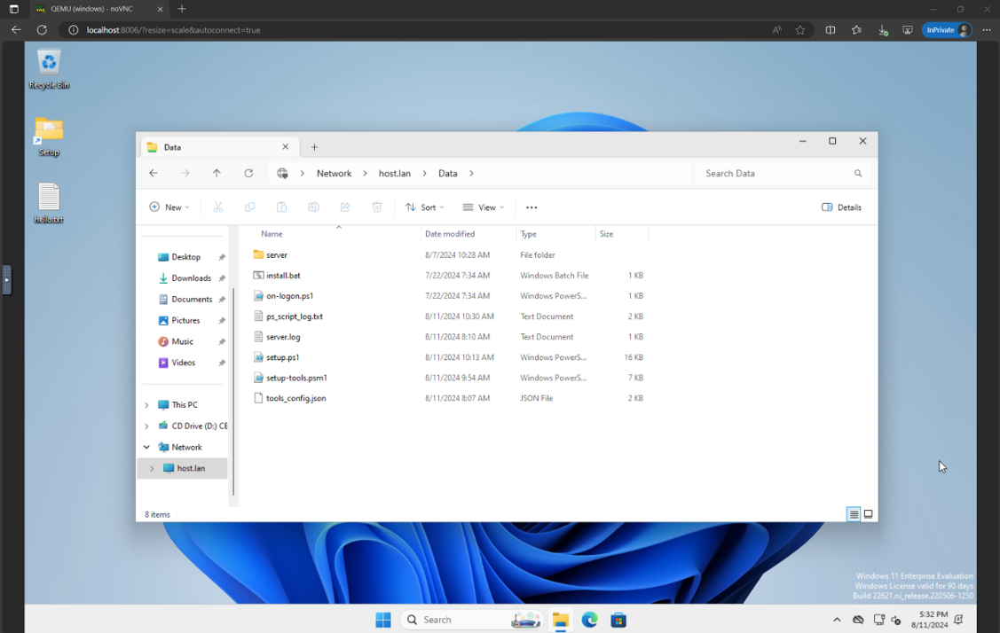

### Dev/Azure Mode

For facilitating the development and testing of the initialization scripts in `src/win-arena-container/vm/setup` and Python server in `src/win-arena-container/vm/setup/server`, we have made a `mode` parameter available in the run-local script. By default, this mode is set to `azure` for optimizing running the benchmark at scale, but you can manually set it to `dev` when preparing the WAA golden image. Doing so will result in a new shared folder being mounted and shared between the Docker host and the Windows 11 VM running on Docker.

```bash
cd ./scripts
./run-local.sh --mode dev --prepare-image true
```

Once prepared, you can run the entire setup at once using:
```bash
./run-local.sh --mode dev --start-client true
```

With the dev mode activated, any code changes made to the `src/win-arena-container/vm/setup` folder on the host will be reflected in the Windows 11 VM (`\\host.lan\Data`), making the overall development flow faster.

<div align="center">
    
</div>

### Reusing WAA Image Snapshots

If you already did the Windows image setup once in the past (either using the dev or Azure mode), you can reuse the image to create new VMs. This is useful if you want to create multiple VMs with the same configuration.

In this case, back up all the Windows image files from the folder `src/win-arena-container/vm/storage`.

```bash
.../storage
    ├── data.img
    ├── windows.base
    ├── windows.boot
    ├── windows.mac
    ├── windows.rom
    ├── windows.vars
    └── windows.ver
```

### Logs

You can troubleshoot any errors occurring during the preparation phase of the golden image (`./run-local --prepare-image true`), by looking at the logs under [src/win-arena-container/vm/setup/ps_script_log.txt](../src/win-arena-container/vm/setup/ps_script_log.txt).

Logs of the Python server running on the Windows 11 VM can instead be found under: [src/win-arena-container/vm/setup/server/server.log](../src/win-arena-container/vm/setup/server/server.log)

### Interactive mode - how to launch the docker without running the vm and client processes:
During the development of any agents and extensions for the benchmark tasks, it might be useful to start the container without starting the client and VM processes. In this case, run:

In this case run:
```bash
cd scripts
./run-local.sh --interactive true
```

If the previous command is successful, the container will run with bash attached as the entry point. You can now check the state of the container and run each of the processes individually with:

```bash
./start_vm.sh
.. 
./start_client.sh
```

### Testing that the Windows 11 VM is accessible from docker

Once the golden image has been prepared and you are ready to run the agent, you can test that the Python server has fully booted (up to 1 minute for a previously initialized VM) and is ready to listen for incoming connections:

```bash
# connect to the running docker
cd scripts
./run-local.sh --connect true
```

```bash
curl -v -X GET http://20.20.20.21:5000/screenshot
# you should get a HTTP/1.1 200 OK respose
```

### Connecting with the Python server from outside the docker:

Inside the attached docker, create a proxy server for the relevant ports (5000, 9222, 1337).

```bash
# connect to the running docker
cd scripts
./run-local.sh --connect true

# It will forward the requests and responses from the ports to the windows server's IP inside the docker
echo -n 5000 9222 1337 | xargs -d ' ' -I% bash -c 'socat tcp-listen:%,fork tcp:
```
